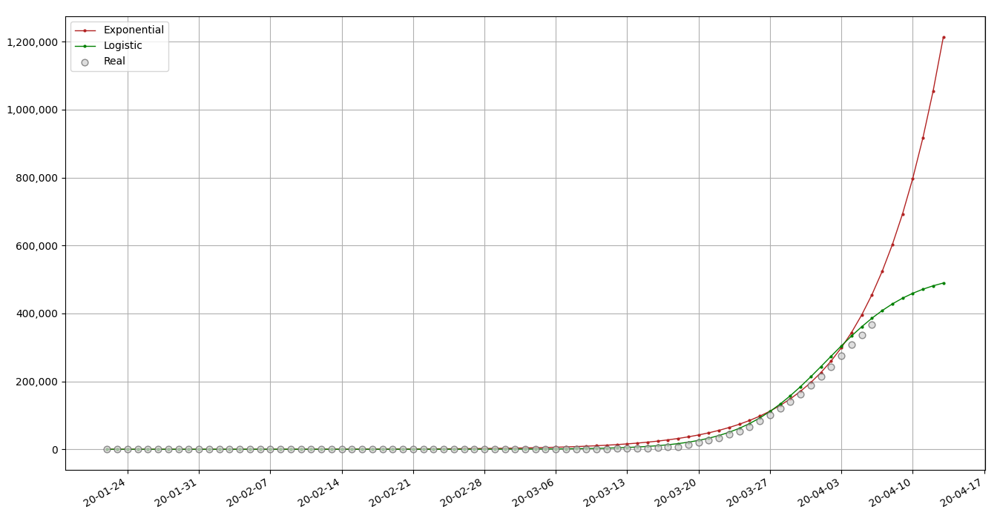

# Corona statistics
Corona statistics. Runs with Python 3+.


## Demo


## How to run
Data from [Johns Hopkins CSSE](https://github.com/CSSEGISandData/COVID-19)

```
$ ./corona.py -l | -g | -c [c|d|r|nc|nd|nr|p] | COUNTRY
```

 - List countries
```
$ ./corona.py -l
```

 - List global data
```
$ ./corona.py -g
```

 - List latest data for all countries and sort by $1:
   - `c`: Confirmed
   - `d`: Deaths
   - `r`: Recovered
   - `nc`: New confirmed
   - `nd`: New deaths
   - `nr`: New recovered
   - `p`: Percentage of cases that are fatal
```
$ ./corona.py -c $1
```

 - List all data for specific country
```
$ ./corona.py <COUNTRY>
```


### Forecast 
 - Plots graph and outputs data based on exponential and logistic functions
   - **Requires** `numpy`, `scipy` and `matplotlib`
```
$ ./forecast.py [COUNTRY]
```

</br>


